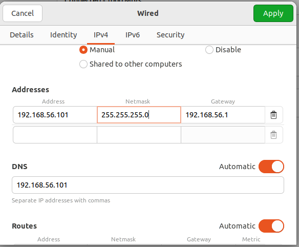
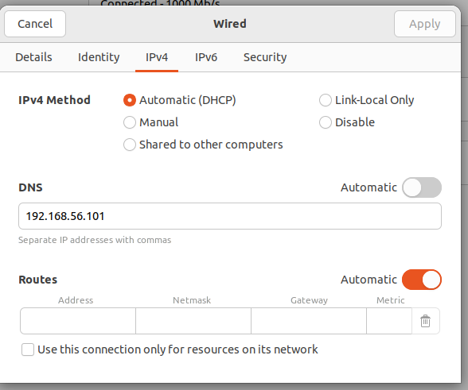

### Features

- Automatic CSR signer website
- Apache2, Bind9, Openssl configured
- Supports Host Only Adapter on Orcale VM for Ubuntu 22.04lts 
- CNN, VSS, CA website configured with signed certificates and https support
- OCSP configured for all the above mentioned websites
- Easy to modify and configure for additional websites and certificates

# README.md


**Table of Contents**

- [Ansible Setup](#ansible-setup)
  - [Installation](#installation)
  - [Ansible Configuration](#ansible-configuration)
- [Server VM Configuration](#server-vm-configuration)
  - [IPv4 Configuration](#ipv4-configuration)
  - [Network Adapter Configuration](#network-adapter-configuration)
- [Database Setup](#database-setup)
- [Apache2 Configuration](#apache2-configuration)
  - [Enabling Sites](#enabling-sites)
  - [Restarting Apache2](#restarting-apache2-after-enabling-sites)
  - [Checking Apache2 Status](#check-apache2-status)
- [Bind9 Configuration](#bind9-configuration)
- [OpenSSL Configuration](#openssl-configuration)
- [Importing the RootCA Certificate in Chrome Browser](#importing-the-rootca-certificate-in-chrome-browser)
- [Additional Configurations & Commands](#additional-configurations--commands)
  - [OCSP Responder](#ocsp-responder)
  - [Revocation of a Certificate](#revocation-of-a-certificate)
  - [Python CSR Autosigner](#python-csr-autosigner)
  - [UFW to Stop Attacks](#ufw-to-stop-attacks)
  - [Setting up Snort for Detection](#setting-up-snort-for-detection)
  - [UI Preview](#ui-preview)
- [Client Configuration](#client-configuration)
  - [Client DNS Configuration](#client-dns-configuration)
  - [Installations](#installations)
  - [Hping3 Attack](#hping3-attack)
  - [Wireshark TLS Handshake & Encrypted Application Data](#wireshark-tls-handshake--encrypted-application-data)
- [Some Useful Links](#some-useful-links)
- [End](#end)

## Ansible Setup
### Installation
First we need to install Ansible for using the playbook for setting up our PKI
Open a new terminal and use the following commands to setup ansible

` sudo apt-add-repository ppa:ansible/ansible`
` sudo apt update`
` sudo apt install ansible`

Open the host file of ansible by using the command below

` sudo nano /etc/ansible/hosts`

Write the configuration below in the hosts file

```markdown
[host_Username]  
localhost ansible_connections=local
```
### Ansible configuration
Open the setup.yaml file using

`sudo nano setup.yaml`

Change the host to your virtual machine host. And change the user to your virtual machine host.

#### Ansible

```yaml
---
- name: Installing and setting up packages on Ubuntu 22.04 LTS
  hosts: host username will be here
  become: yes
  become_user: root

  vars:
      user: "path to repository folder"
  tasks:
  - name: Installing required packages
    apt:
      name:
        - apache2
        - bind9
        - bind9utils
        - php-pgsql
        - openssl
        - ufw
        - tree
        - php
        - libapache2-mod-php
      force_apt_get: yes

  - name: Run shell commands for webserver setup
    ansible.builtin.shell: {{user}}/command_1.sh

  - name: Run shell commands for DNS setup
    ansible.builtin.shell: {{user}}/command_2.sh

  - name: Run shell commands for openssl CA setup
    ansible.builtin.shell: {{user}}/command_3.sh

```

To run the setup.yaml ansible playbook navigate to your folder in which you cloned this repository and open terminal and run the command below

`sudo ansible-playbook setup.yaml`

> ⚠️ **Warning:**Run this command after configuring the openssl.

> ⚠️ **Warning:** If the playbook shows any errors related to openssl commands and the task fails then try using the playbook as root user.


# Server VM Configuration
### IPv4 configuration
Go to Settings in your virtual machine and click on Network


Now click on ipv4 and configure it as shown below


### Network Adapter configuration
First go to settings of your virtual machine


Then go to Network 


After that, change the network adapter from NAT to Host-only Adapter



> ⚠️ **Warning:** You might have to reboot the virtual machine afterwards after the onfiguration using the command ` reboot` in terminal


# Database Setup
Log in to PostgreSQL as the default superuser (usually postgres)

` sudo -u postgres psql`

Create a new database (e.g., cnn) and a new user (e.g., postgres) with a password

` CREATE DATABASE cnn;`
` CREATE USER postgres WITH PASSWORD 'your_password'; `

Grant all privileges on the database to the user
` GRANT ALL PRIVILEGES ON DATABASE cnn TO postgres;`

Exit psql:
` \q`

Do the same process for vss, cm and other websites.
#Apache2 Configuration
After running the ansible-playbook do the following 

### Enabling sites
` sudo a2ensite cnn.conf`
` sudo a2ensite vss.conf`
` sudo a2ensite cm.conf`

These commands will enable the sites based on the .conf files of the websites.
### Restarting apache2 after enabling sites
` sudo apachectl restart` or,
` sudo systemctl restart apache2`

These commands are used for restarting the apache2 for the configurations of the websites. Both of them have the same functionality. 

### Check apache2 status
Use the command below to check the status of apache2 to see if apache2 service is active.

`sudo systemctl status apache2` or,
` sudo apachectl status`

# Bind9 Configuration
For bind9 change the server virtual machine host name to ns1 and  just restarting the bind9 service should be enough.

To change hostname:
`sudo  `

To restart bind9:
` sudo systemctl restart bind9`

To check if bind9 is active:
` sudo systemctl status bind9`

# Openssl Configuration
After cloing this repository change the hostname in the .conf files to your virtual machine hostname.

`sudo nano AcmeRootCA.conf.j2`

`sudo nano AcmeSubCAOne.conf.j2`

`sudo nano AcmeSubCATwo.conf.j2`

`sudo nano AcmeSubCATwoSigner.conf.j2`

`sudo nano cm.autosigner.j2`

`sudo nano cm.opensslConf.j2`

`sudo nano cnn.opensslConf.j2`

`sudo nano OCSP.conf.j2`

`sudo nano vss.opensslConf.j2`

`sudo nano catwo.conf.j2`

Edit the $USER for declaring proper path for the CA files

`sudo nano command_3.sh`


# Importing the RootCA certificate in Chrome browser
1. First install Chrome if not installed in Ubuntu 22.04lts
2. Then open chrome and go to settings.


3. After that click on Privacy and Security 


4. Click on Security 


5. Click on Manage Certificates


6. Click on Authorities and import the rootCA.crt file


# Additional Configurations & Commands
### OCSP Responder
Navigate to the ca folder 

` cd /home/Your_Hostname/ca`

Open a new terminal and run the following command

```Openssl
openssl ocsp -index AcmeSubCATwo/index -port 9999 -rsigner ocsp/certs/ocsp.crt -rkey ocsp/private/ocsp.key -CA AcmeSubCATwo/certs/ca.crt -text
```

### Revocation of a Certificate
First open the AcmeSubCATwo index file using 

` cat /home/HostName/ca/AcmeSubCATwo/index`

Copy the serial number or ID.pem associated with the website

To revoke a certificate of a specific website, use the following command in the terminal

```openssl
openssl ca -config AcmeSubCATwo/AcmeSubCATwo.conf -revoke AcmeSubCATwo/newcerts/serial_num.pem
```

This will revoke the certificate of the specific website.


### Python CSR Autosigner
Open a new terminal and run the following command
` sudo python3 testing.py`
This will start the python backend code that will sign the csr whenever a csr is posted on the CA website.

#### How it works?


- **<u>Step-1:</u>** Domain name and csr.pem file is uploaded and submitted.
- **<u>Step-2:</u>** Data is stored in the Postgresql database table.
- **<u>Step-3:</u>** Python script which is always running in the terminal gets notified - that there is a data entry and retrieves the data from postgresql.
- **<u>Step-4:</u>** Python script creates the signed cert using the openssl command using the shell execution in python which is executed using suprocess package run function.
- **<u>Step-5:</u>** Python script saves the signed certificate file in a specific directory in the server.
- **<u>Step-6:</u>** Python deletes the entry from the postgresql table after the task is finished.
- **<u>Step-7:</u>** CA website points to the specific directory from which the signed certificate can be downloaded.

### UFW To Stop Attacks
` sudo ufw deny ip_address`
` sudo systemctl restart ufw`

First the attacker IP address which was observed from the snort is blocked and then restarting the ufw is required afterwards for the rules to take effect.


### Setting up Snort for detection
#### Configuration
After installing snort we need to configure the snort.conf file and make the changes below:
First open the snort.conf file using
` sudo nano /etc/snort/snort.conf`

Set the ipvar HOME_NET to 192.168.56.0/24


Comment out the portvar FTP_PORTS [21,2100,353553] because it creates an error and also we do not need it as well.


Then finally in the for the portvar HTTP_PORTS add your available ports here in which you would like to detect the attacks.


#### Start Snort
Now we will run the following command in the terminal:

` sudo snort -A console -c /etc/snort/snort.conf`

This will start the snort service and keep on detecting any attacks that comes to the server.


### UI Preview
#### CNN Website UI


#### VSS Website UI


#### CA Website UI


### Client Configuration
#### Client DNS Configuration


#### Installations
` sudo apt install hping3 wireshark`

#### Hping3 attack
For example:
`sudo hping3 -S --flood -V -p 443 www.cnn.com or 192.168.56.101`

Here S means the SYN and –S –flood basically means SYN Flood attack on –p which is port and let’s say port 443 and then ip address or website address.

#### Wireshark TLS Handshake & Encrypted Application Data
Open wireshark

` sudo wireshark`

Start capturing packets and then visit the website from the client and then after visiting the website, stop capturing the packets and then filter in wireshark using `ip.addr==192.168.56.101` to verify the TLS handshake and see if the application data is encrypted.


### Some Useful Links

- [How To Install the Apache Web Server on Ubuntu](https://www.digitalocean.com/community/tutorials/how-to-install-the-apache-web-server-on-ubuntu-22-04)

- [How To Configure BIND as a Private Network DNS Server on Ubuntu 22.04](https://www.digitalocean.com/community/tutorials/how-to-configure-bind-as-a-private-network-dns-server-on-ubuntu-22-04)

- [An Introduction to DNS Terminology, Components, and Concepts](https://www.digitalocean.com/community/tutorials/an-introduction-to-dns-terminology-components-and-concepts)

- [Install and Configure Linux DNS Server](https://www.youtube.com/playlist?list=PL291a0KYQZSK6E_1j9xkkieCOi_867pyc)

- [Masterclass in openSSL](https://www.youtube.com/watch?v=d8OpUcHzTeg)

- [Intro To SCEP And OCSP](https://youtu.be/IuhtS03rS9M?si=lEBsBzZ-8YM4DFqR)


### End
Thank you for the visit!!! 😊😊😊